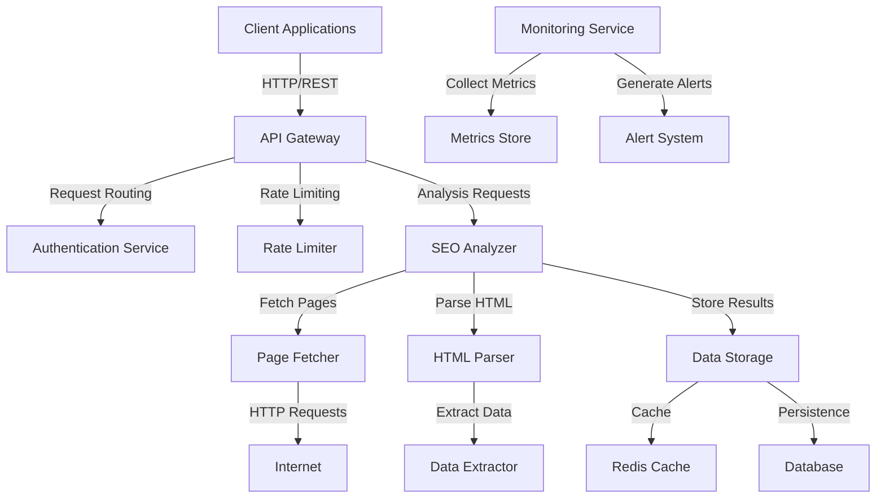
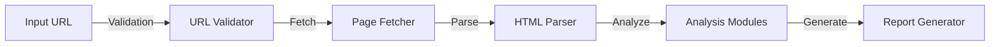
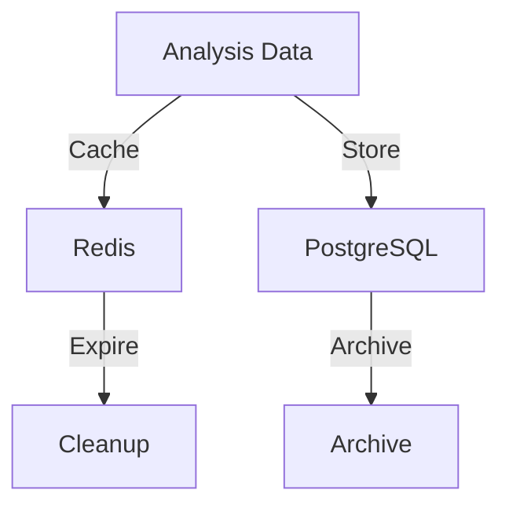
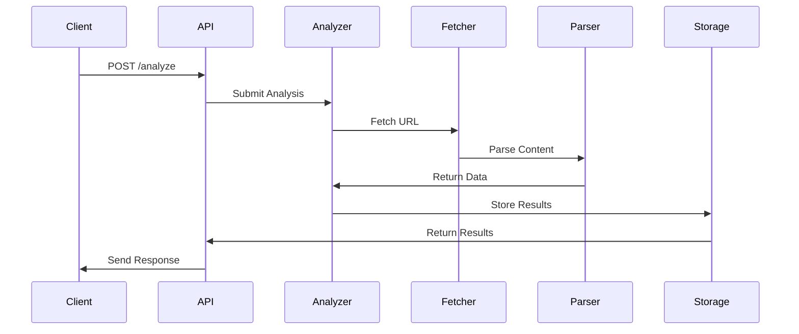
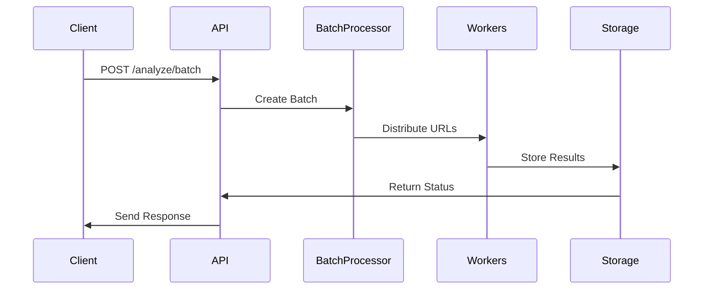
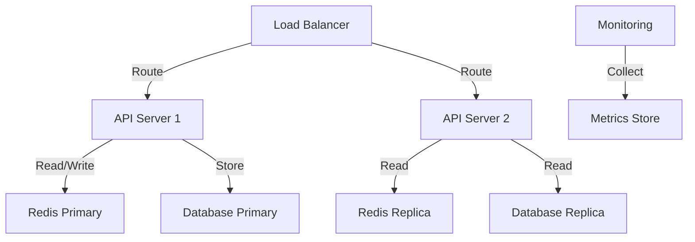

# Architecture Overview

This document describes the architecture of TFQ0SEO, including its components, data flow, and design decisions.

## System Architecture

## Component Details

### 1. API Gateway
- Handles incoming HTTP requests
- Routes requests to appropriate services
- Implements rate limiting and authentication
- Manages request/response transformation

Technologies:
- aiohttp for async HTTP handling
- JWT for authentication
- Token bucket algorithm for rate limiting

### 2. SEO Analyzer
- Core analysis engine
- Coordinates analysis tasks
- Manages concurrent operations
- Implements analysis pipeline

Components:

### 3. Page Fetcher
- Handles HTTP requests
- Manages connections and timeouts
- Implements retry logic
- Handles different content types

Features:
- Connection pooling
- DNS caching
- Proxy support
- Compression handling

### 4. HTML Parser
- Parses HTML content
- Extracts structured data
- Identifies page elements
- Memory-efficient processing

Technologies:
- BeautifulSoup4 for parsing
- lxml for performance
- Custom memory management

### 5. Data Storage
- Manages data persistence
- Handles caching
- Implements data lifecycle

Architecture:

### 6. Monitoring System
- Collects performance metrics
- Monitors system health
- Generates alerts
- Provides dashboards

Metrics:
- Response times
- Error rates
- Resource usage
- Cache hit rates

## Data Flow

### Analysis Request Flow

### Batch Processing Flow

## Performance Optimizations

### 1. Caching Strategy
- Multi-level caching
- Cache warming
- Intelligent invalidation
- Memory management

### 2. Concurrency
- Async I/O operations
- Connection pooling
- Task queuing
- Resource limits

### 3. Memory Management
- Streaming processing
- Garbage collection
- Memory limits
- Resource cleanup

## Security Measures

### 1. Authentication
- API key validation
- JWT tokens
- Role-based access
- Token rotation

### 2. Rate Limiting
- Per-user limits
- Burst handling
- Token bucket algorithm
- Backoff requirements

### 3. Input Validation
- URL validation
- Parameter sanitization
- Content validation
- Error handling

## Scalability

### 1. Horizontal Scaling
- Stateless design
- Load balancing
- Service discovery
- Data partitioning

### 2. Vertical Scaling
- Resource optimization
- Performance tuning
- Memory management
- CPU utilization

## Monitoring and Alerting

### 1. System Metrics
- CPU usage
- Memory usage
- Disk I/O
- Network I/O

### 2. Application Metrics
- Response times
- Error rates
- Cache hit rates
- Queue lengths

### 3. Business Metrics
- Analysis counts
- User activity
- Feature usage
- Error patterns

## Deployment Architecture

## Configuration Management

### 1. Environment Variables
- API settings
- Security settings
- Performance tuning
- Feature flags

### 2. Configuration Files
- Service configs
- Logging configs
- Cache settings
- Database settings

## Error Handling

### 1. Error Categories
- Client errors
- Server errors
- Network errors
- Resource errors

### 2. Recovery Strategies
- Retry logic
- Circuit breaking
- Fallback options
- Error reporting

## Future Improvements

### 1. Planned Features
- Machine learning analysis
- Real-time monitoring
- Advanced reporting
- API versioning

### 2. Technical Debt
- Code optimization
- Test coverage
- Documentation
- Refactoring

## Development Guidelines

### 1. Code Standards
- Type hints
- Documentation
- Testing
- Reviews

### 2. Best Practices
- Error handling
- Performance
- Security
- Maintainability 